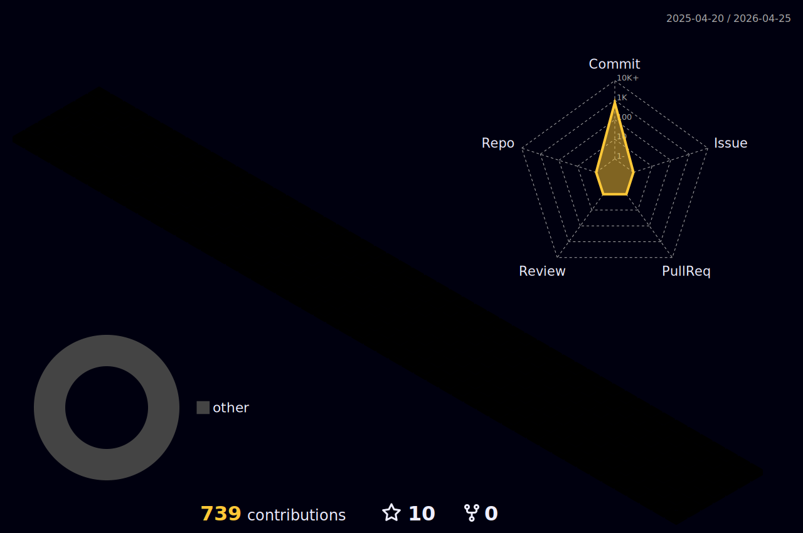

<h3 align="center">
  Hi there!
  
</h3>

I am a linux enthusiast and a programmer. I like system programming the most. I'm fluent in Python and Java. I'm also interested with Go and Rust. Currenty I'm learning Flutter (at least so I can get a taste of front-end stuff). I'm also focusing on competetive programming to increase My problem solving skills.

I'm an expert with all kinds of linux stuff (general linux usage, distros, command-line tools, RICING! and stuff like that). If you don't believe me, let's get down to a challenge!

And I use arch, **btw**

